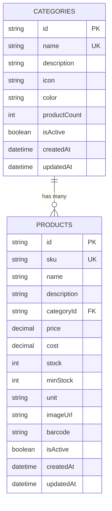

# Database Schema - SimpleStock Inventory System

## ER Diagram (Entity Relationship Diagram)



## Entity Descriptions

### 1. **CATEGORIES** - หมวดหมู่สินค้า
จัดกลุ่มสินค้าตามประเภท เช่น อิเล็กทรอนิกส์, เสื้อผ้า, อาหารและเครื่องดื่ม

**ฟิลด์สำคัญ:**
- `id` - รหัสหมวดหมู่ (Primary Key)
- `name` - ชื่อหมวดหมู่ (ต้องไม่ซ้ำ)
- `description` - รายละเอียดหมวดหมู่
- `icon` - ไอคอน FontAwesome เช่น "fa-laptop"
- `color` - สีของหมวดหมู่ในรูปแบบ hex เช่น "#667eea"
- `productCount` - จำนวนสินค้าในหมวดหมู่ (คำนวณอัตโนมัติ)
- `isActive` - สถานะเปิด/ปิดใช้งาน
- `createdAt` - วันที่สร้าง
- `updatedAt` - วันที่แก้ไขล่าสุด

### 2. **PRODUCTS** - สินค้า
ข้อมูลสินค้าทั้งหมดในระบบ รวมถึงราคา จำนวนคงเหลือ และรายละเอียด

**ฟิลด์สำคัญ:**
- `id` - รหัสสินค้า (Primary Key)
- `sku` - รหัสอ้างอิง Stock Keeping Unit (ต้องไม่ซ้ำ)
- `name` - ชื่อสินค้า
- `description` - รายละเอียดสินค้า
- `categoryId` - รหัสหมวดหมู่ (Foreign Key → CATEGORIES)
- `price` - ราคาขาย
- `cost` - ราคาทุน (optional)
- `stock` - จำนวนคงเหลือ
- `minStock` - จำนวนขั้นต่ำสำหรับแจ้งเตือน
- `unit` - หน่วยนับ เช่น "ชิ้น", "กล่อง", "กิโลกรัม"
- `imageUrl` - รูปภาพสินค้า (base64 หรือ URL)
- `barcode` - บาร์โค้ด
- `isActive` - สถานะเปิด/ปิดใช้งาน
- `createdAt` - วันที่สร้าง
- `updatedAt` - วันที่แก้ไขล่าสุด

## Key Relationship

**CATEGORIES → PRODUCTS** (One-to-Many)
- หมวดหมู่หนึ่งมีสินค้าได้หลายรายการ
- สินค้าหนึ่งรายการอยู่ในหมวดหมู่เดียว
- ไม่สามารถลบหมวดหมู่ที่มีสินค้าได้ (RESTRICT)

## Indexes (สำหรับ Performance)

```sql
-- Categories
CREATE INDEX idx_categories_name ON categories(name);
CREATE INDEX idx_categories_is_active ON categories(is_active);

-- Products
CREATE INDEX idx_products_sku ON products(sku);
CREATE INDEX idx_products_category ON products(category_id);
CREATE INDEX idx_products_barcode ON products(barcode);
CREATE INDEX idx_products_is_active ON products(is_active);
```

## Business Rules (กฎทางธุรกิจ)

### 1. **Category Management**
- ชื่อหมวดหมู่ต้องไม่ซ้ำกัน
- ไม่สามารถลบหมวดหมู่ที่มีสินค้าอยู่
- สามารถปิดการใช้งานหมวดหมู่ได้ (`isActive = false`)

### 2. **Product Management**
- SKU ต้องไม่ซ้ำกัน (ใช้เป็นรหัสอ้างอิงเฉพาะ)
- ราคาขาย (price) ต้อง >= 0
- จำนวนคงเหลือ (stock) ต้อง >= 0
- ราคาทุน (cost) ควรน้อยกว่าหรือเท่ากับราคาขาย (มิฉะนั้นขาดทุน)

### 3. **Stock Alert**
- เมื่อ stock <= minStock ให้แสดงการแจ้งเตือน "สินค้าใกล้หมด"
- เมื่อ stock = 0 ให้แสดงสถานะ "สินค้าหมด"

### 4. **Data Integrity**
- สินค้าทุกรายการต้องมีหมวดหมู่ (categoryId is required)
- ใช้ Soft Delete สำหรับสินค้า (isActive = false) แทนการลบจริง
- ห้ามลบหมวดหมู่ที่มีสินค้าอยู่ (Foreign Key RESTRICT)
