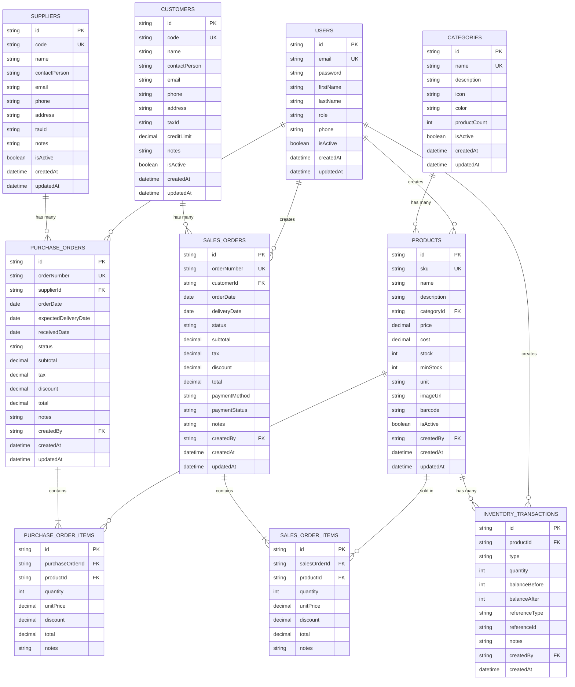

# Database Schema - SimpleStock Inventory System

## ER Diagram (Entity Relationship Diagram)



## Entity Descriptions

### Core Entities

#### 1. **USERS** - ผู้ใช้งานระบบ
- บริหารจัดการผู้ใช้งานทั้งหมด
- Roles: admin, manager, staff
- ใช้สำหรับ authentication และ authorization

#### 2. **CATEGORIES** - หมวดหมู่สินค้า
- จัดกลุ่มสินค้าตามประเภท
- มี icon และ color สำหรับแสดงผล
- นับจำนวนสินค้าในแต่ละหมวดหมู่

#### 3. **PRODUCTS** - สินค้า (ตาราง core)
- ข้อมูลสินค้าทั้งหมด
- ติดตาม stock, price, cost
- เชื่อมโยงกับ category และ user ที่สร้าง

#### 4. **SUPPLIERS** - ผู้จัดจำหน่าย
- ข้อมูลซัพพลายเออร์
- ใช้สำหรับการสั่งซื้อสินค้า
- เก็บข้อมูลติดต่อและเลขประจำตัวผู้เสียภาษี

#### 5. **CUSTOMERS** - ลูกค้า
- ข้อมูลลูกค้า
- ใช้สำหรับการขายสินค้า
- มี credit limit สำหรับการควบคุมเครดิต

### Transaction Entities

#### 6. **PURCHASE_ORDERS** - ใบสั่งซื้อ
- สั่งซื้อสินค้าจากซัพพลายเออร์
- Status: pending, confirmed, received, cancelled
- เชื่อมกับ PURCHASE_ORDER_ITEMS

#### 7. **PURCHASE_ORDER_ITEMS** - รายการสินค้าในใบสั่งซื้อ
- รายละเอียดสินค้าแต่ละรายการ
- เก็บ quantity, price, discount

#### 8. **SALES_ORDERS** - ใบสั่งขาย
- ขายสินค้าให้ลูกค้า
- Status: pending, confirmed, delivered, cancelled
- Payment Status: unpaid, partial, paid

#### 9. **SALES_ORDER_ITEMS** - รายการสินค้าในใบสั่งขาย
- รายละเอียดสินค้าแต่ละรายการที่ขาย
- เก็บ quantity, price, discount

#### 10. **INVENTORY_TRANSACTIONS** - การเคลื่อนไหวสต็อก
- บันทึกทุกการเปลี่ยนแปลงของ stock
- Type: purchase, sale, adjustment, return
- เก็บ balance before/after เพื่อ audit trail

## Key Relationships

1. **Products → Categories** (Many-to-One)
   - สินค้าหลายรายการอยู่ในหมวดหมู่เดียวกันได้

2. **Purchase Orders → Suppliers** (Many-to-One)
   - ซัพพลายเออร์หนึ่งรายสามารถมีหลาย PO

3. **Sales Orders → Customers** (Many-to-One)
   - ลูกค้าหนึ่งรายสามารถมีหลายออเดอร์

4. **Orders → Items** (One-to-Many)
   - ทั้ง PO และ SO มีหลาย items

5. **Products → Inventory Transactions** (One-to-Many)
   - สินค้าหนึ่งตัวมีหลาย transactions

## Indexes Recommendations

```sql
-- Products
CREATE INDEX idx_products_sku ON PRODUCTS(sku);
CREATE INDEX idx_products_category ON PRODUCTS(categoryId);
CREATE INDEX idx_products_barcode ON PRODUCTS(barcode);

-- Orders
CREATE INDEX idx_purchase_orders_supplier ON PURCHASE_ORDERS(supplierId);
CREATE INDEX idx_purchase_orders_status ON PURCHASE_ORDERS(status);
CREATE INDEX idx_sales_orders_customer ON SALES_ORDERS(customerId);
CREATE INDEX idx_sales_orders_status ON SALES_ORDERS(status);

-- Inventory
CREATE INDEX idx_inventory_product ON INVENTORY_TRANSACTIONS(productId);
CREATE INDEX idx_inventory_type ON INVENTORY_TRANSACTIONS(type);
CREATE INDEX idx_inventory_created ON INVENTORY_TRANSACTIONS(createdAt);
```

## Business Rules

1. **Stock Management**
   - Stock ไม่สามารถติดลบได้
   - ต้องมี inventory transaction ทุกครั้งที่ stock เปลี่ยนแปลง
   - Alert เมื่อ stock <= minStock

2. **Order Processing**
   - Purchase Order → เพิ่ม stock เมื่อ received
   - Sales Order → ลด stock เมื่อ confirmed
   - ไม่สามารถลบ order ที่ confirmed แล้ว (ต้อง cancel)

3. **Pricing**
   - Price ต้อง >= 0
   - Cost ต้อง <= Price (หรือ warning)
   - Discount ไม่เกิน 100%

4. **Data Integrity**
   - ไม่สามารถลบ category ที่มีสินค้า
   - ไม่สามารถลบ supplier/customer ที่มี orders
   - Soft delete สำหรับ products (isActive = false)
